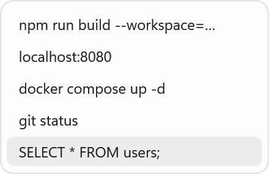
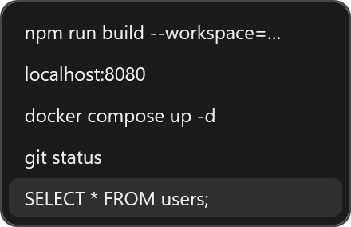

<p align="center">
  
</p>

<p align="center">
  <strong>English</strong> | <a href="README.md">简体中文</a>
</p>

# MiniClip

> A text-only clipboard history app for Windows 10 and 11. Open a popup near the text cursor and select previously copied text with the keyboard. The popup does not take focus, so the original input window remains active.

MiniClip runs in the system tray and does not provide cloud sync or telemetry. [Download the latest release](https://github.com/chaoy1/MiniClip/releases/latest).

## Highlights

- **Keyboard-first workflow:** Press `Alt + V` by default, use `↑` / `↓` to select, `Enter` to paste, and `Esc` to close. The shortcut is configurable.
- **Focus stays put:** The popup does not activate. It appears near the text cursor when coordinates are available, or near the focused control or window otherwise.
- **Bounded history:** Up to 100 entries and 500,000 characters in total. Exact duplicate text is deduplicated; images, files, and rich text are ignored.
- **Paste safeguards:** MiniClip checks the destination window before pasting. It cancels automatic paste if the destination changes or new clipboard content replaces the selected text.
- **Local storage:** History is saved as plain-text JSON. The tray menu provides history clearing, appearance options, and Settings.

## Preview

| Light | Dark |
| --- | --- |
|  |  |

[Tray menu](docs/images/tray-menu.png) · [Settings window](docs/images/settings.png) · [Interface design (Chinese)](docs/DESIGN.md)

## Quick Start

Download a Windows x64 package from [GitHub Releases](https://github.com/chaoy1/MiniClip/releases/latest):

| Download | How to use it |
| --- | --- |
| `MiniClip-Setup-<version>-x64.exe` | Recommended. Run the installer; it includes the .NET 10 Desktop Runtime. You can choose the installation directory, startup option, and desktop shortcut. |
| `MiniClip-<version>-win-x64.zip` | Extract the entire archive and run `MiniClip.exe`. The computer must already have the [.NET 10 Desktop Runtime](https://dotnet.microsoft.com/download/dotnet/10.0). |

The installer is currently unsigned, so Windows may ask you to confirm its source. MiniClip has no main window; look for its icon in the system tray after launch.

## Keyboard and tray

`Alt + V` open or close the popup · `↑` / `↓` select an entry · `Enter` paste into the original window · `Esc` close

Right-click the tray icon to clear history, choose Light/Dark/Follow System, open Settings, or exit. Double-click it to open Settings. Clearing history does not clear the current Windows clipboard contents.

## How It Works

```text
Copy text → Clipboard listener → Deduplication and limits → Local JSON history
                                                            ↓
Original window ← Destination check and Ctrl+V ← Keyboard selection ← Alt+V popup
```

The popup does not take keyboard focus. When you press Enter, MiniClip checks the original destination, places the selected text on the system clipboard, then checks the destination and clipboard again after a short delay before sending `Ctrl + V`. The application source is under `src/MiniClip/`; build and verification instructions are linked below.

## Data and privacy

- History is stored locally as **plain-text JSON**. MiniClip does not detect passwords or verification codes, so copied secrets may be recorded. Diagnostic logs do not contain clipboard text.
- When the application directory is writable, history, settings, and logs live in `data\` beside `MiniClip.exe`. Otherwise, MiniClip falls back to `%LOCALAPPDATA%\MiniClip\` and shows a notice.
- Uninstalling the installed version deletes its `data\` directory and `%LOCALAPPDATA%\MiniClip\`. Back up any history you want to keep. The portable version has no uninstaller; check the data location before removing its directory. File deletion is not secure erasure.

## Known limitations

- A non-elevated MiniClip process cannot inject a paste shortcut into an administrator-level window. If the text is on the clipboard, paste manually with `Ctrl + V`.
- Some apps do not expose text cursor coordinates. Custom controls, games, and secure desktops may also reject simulated paste input.
- Only one MiniClip instance can run at a time.

## Development

Install the .NET 10 SDK on Windows, then build from the repository root:

```powershell
dotnet build src\MiniClip\MiniClip.csproj -c Release
```

The installer is built with `tools/build-installer.ps1` and Inno Setup. See the [build guide (Chinese)](docs/BUILD.md) for release steps, self-tests, and environment requirements.

## Documentation

| Guide | Contents |
| --- | --- |
| [Build and release (Chinese)](docs/BUILD.md) | Prerequisites and steps for installer and portable packages. |
| [Verification (Chinese)](docs/VERIFICATION.md) | Self-test coverage and manual release checks. |
| [Interface design (Chinese)](docs/DESIGN.md) | Current themes, layout, and screenshots. |

The repository tracks source code, documentation, and presentation images. Release packages and local test outputs are not tracked in Git.
