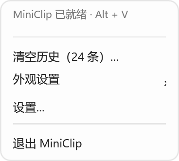
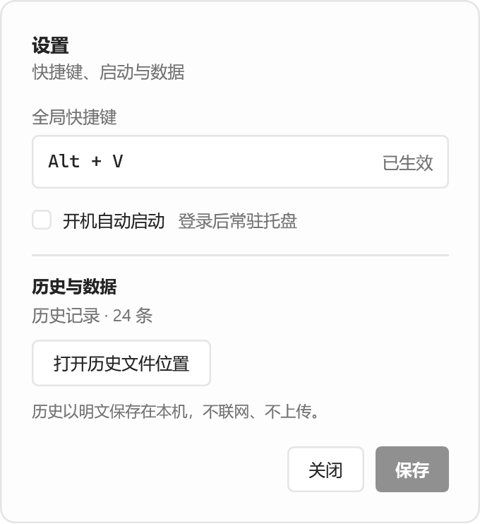

# 界面设计

MiniClip 使用中性浅色与深色界面。候选窗口仅显示文本历史，不显示工具栏或操作提示；键盘交互在两种主题下保持一致。外观可以在托盘菜单中设为浅色、深色或跟随系统。

| 界面元素 | 浅色 | 深色 |
| --- | --- | --- |
| 候选窗口背景 | `#FDFDFD` | `#1B1B1B` |
| 当前选中项 | `#ECECEC` | `#303030` |
| 边框 | `#E5E5E5` | `#454545` |
| 正文 | `#242424` | `#F0F0F0` |

候选窗口宽 220 DIP，单行高 26 DIP，最多同时显示五行。长文本以单行预览呈现，超出部分省略；历史记录可使用方向键滚动选择。当前颜色定义见 [`PopupThemePalette.cs`](../src/MiniClip/UI/PopupThemePalette.cs)，布局见 [`PopupWindow.xaml`](../src/MiniClip/UI/PopupWindow.xaml)。

| 浅色候选窗口 | 深色候选窗口 |
| --- | --- |
|  |  |

设置窗口和托盘菜单使用相同的中性色系；其颜色定义见 [`ChromeThemePalette.cs`](../src/MiniClip/UI/ChromeThemePalette.cs)。下图为当前 WPF 界面的展示截图：

| 托盘菜单 | 设置窗口 |
| --- | --- |
|  |  |

这些图片用于展示布局和外观。真实窗口位置、系统缩放与字体渲染会随设备环境变化。运行 `--selftest` 可在本机生成新的 WPF 截图，步骤见 [验证说明](VERIFICATION.md)。
